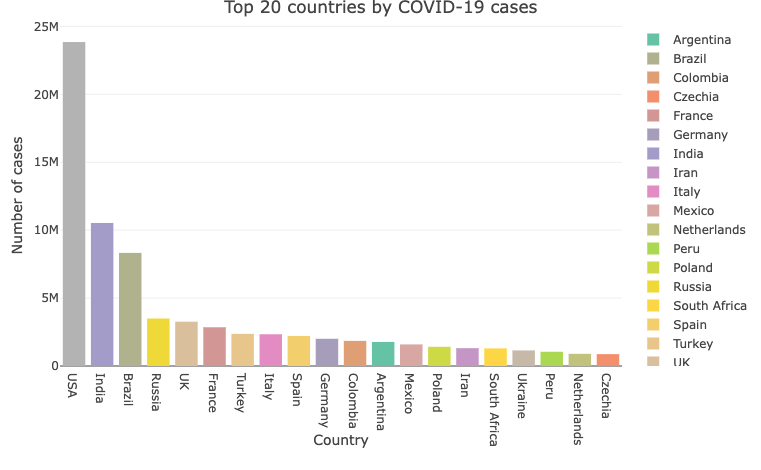
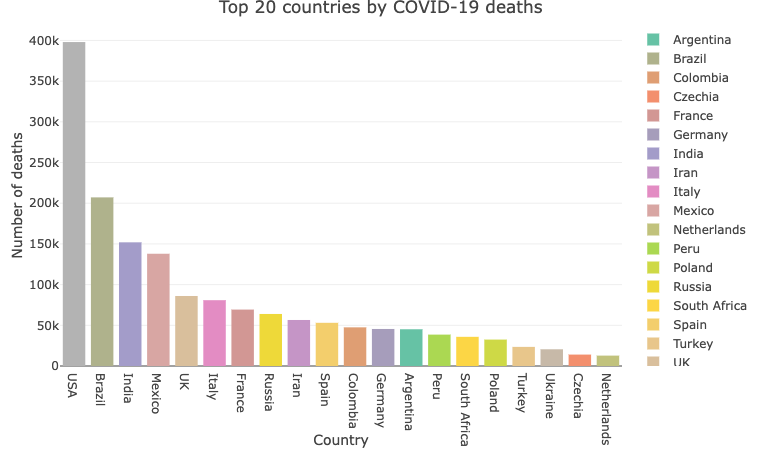
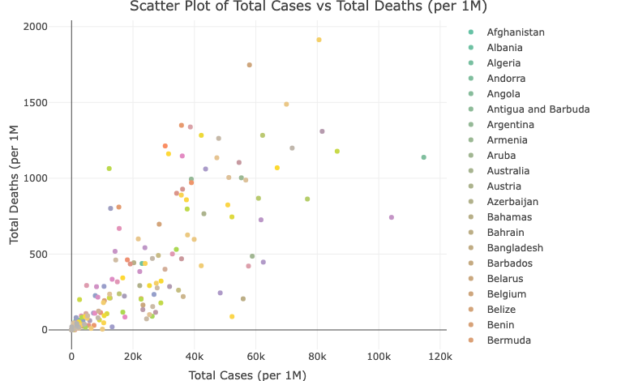
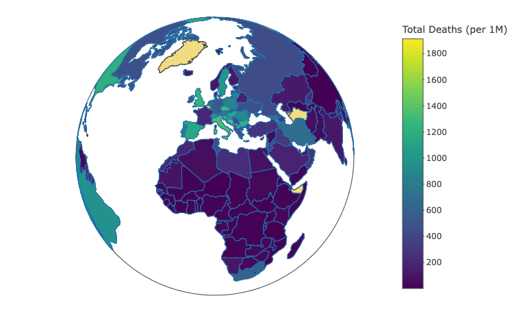
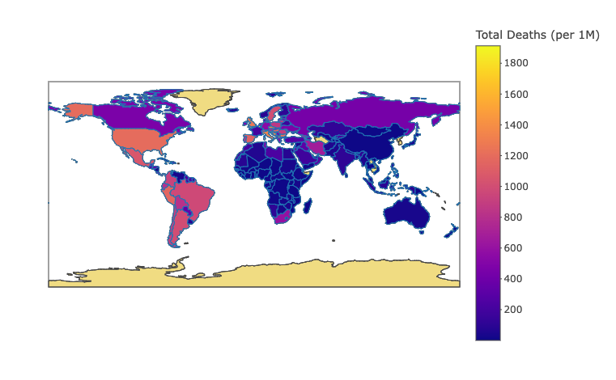
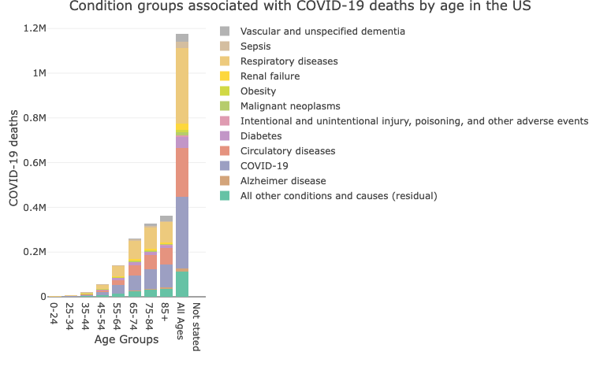
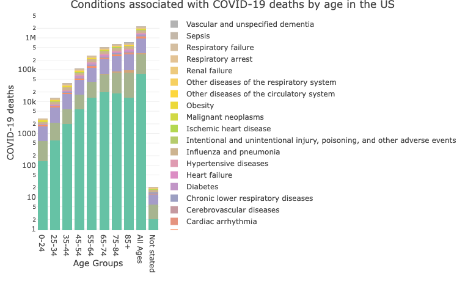
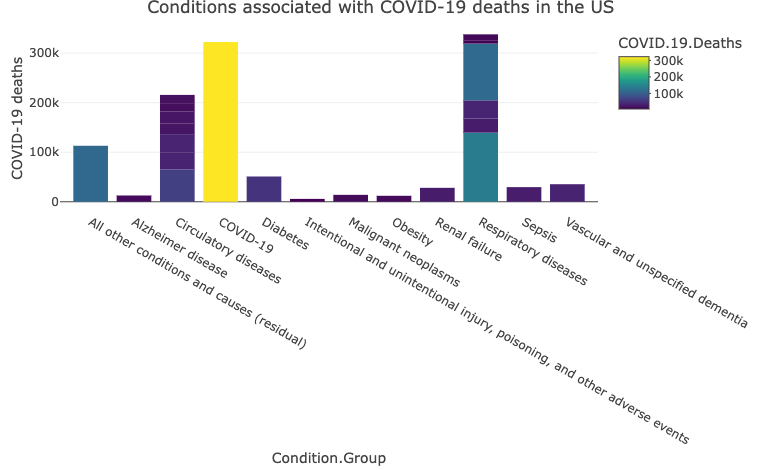
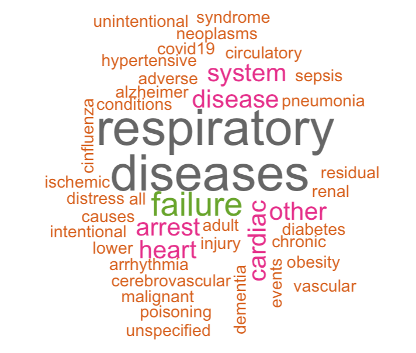
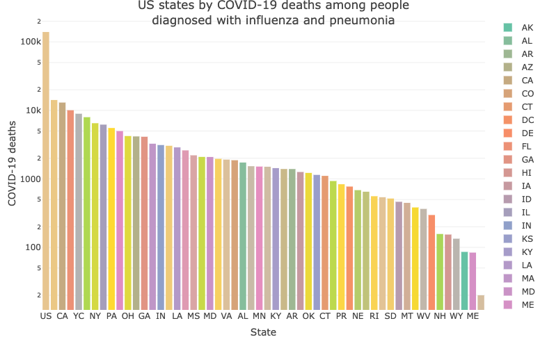

# Covid-19 Death Analysis & Visualisation
Note: this is a static version. Follow the [link](https://rpubs.com/victoria_z/1170373 "link (rpubs)") for an interactive version. 

**Introduction**

The COVID-19 pandemic's mortality patterns offer essential insights into public health risks and response efficacy. This project leverages 2021 data from Worldometer to analyze death rates worldwide and examines US medical data to identify prevalent health conditions that intensify the risk of fatal outcomes.

**Top 20 countries by COVID-19 cases and deaths**

The bar charts showing the top 20 countries by COVID-19 cases and deaths reveal that the USA, India, and Brazil experience the heaviest burden in both measures, yet the figures are not normalised for population sizes. 

When observed closely, Turkey's high case count does not correspond with its position in the mortality chart, potentially indicating effective medical interventions or demographic factors that reduce fatality rates. On the other hand, Mexico's mortality ranking is disproportionately high compared to its case count, which could imply issues such as healthcare resource limitations or differences in reporting standards. 

These disparities underscore the necessity of considering per capita metrics for a more accurate understanding of the pandemic's impact.

**Normalised Data Analysis of COVID-19 Case and Mortality Rates**

The scatter plot compares the number of COVID-19 cases per 1 million people against the number of deaths per 1 million people for all countries. 

The dense clustering of dots towards the lower end of both axes suggests that a majority of the countries have lower rates of cases and deaths per million, while a few outliers have significantly higher rates, indicating severe outbreaks.

The higher death rates with lower case counts in countries like Mexico, Italy, and Bosnia may point to limited healthcare resources, older population or a higher prevalence of comorbidities that exacerbate COVID-19. Conversely, the lower death rates despite high case counts in Qatar and Bahrain could indicate a younger population, systematic mass testing revealing a broader range of mild or asymptomatic cases or the opposite - deaths misdiagnosis due to the lack of testing or challenges in attributing deaths to COVID-19 versus other comorbid conditions.

Countries like San Marino and Andorra stand out with high numbers in both cases and deaths per million, which might reflect the impact of the pandemic on small states where absolute numbers can be misleading due to their small populations. This could also be influenced by their high population density or frequent cross-border interaction with neighboring countries.

Understanding these nuances is essential for forming an accurate picture of the pandemic's impact and underlines the need for targeted public health interventions tailored to the specific needs and circumstances of each country. 

**World Maps**

To enhance the visual comparison of COVID-19 deaths per 1 million people across different countries, the data have been represented in the form of world maps.

**Conditions associated with COVID-19 deaths**

The chart reflects a clear trend of increasing COVID-19 deaths with advancing age, a pattern that aligns with the broader understanding of the virus's impact. The prominence of respiratory and circulatory diseases as significant comorbid conditions associated with COVID-19 deaths in the chart underscores the heightened vulnerability of individuals with such underlying health issues. The presence of COVID-19 as its own category among these conditions also suggests that while comorbidities play a substantial role, the virus itself is a major direct cause of mortality across different age groups, particularly in the elderly population.

The data indicates that Adult Respiratory Distress Syndrome (ARDS) is the most significant condition contributing to COVID-19 related deaths across all age groups. This finding is consistent with our understanding of COVID-19 as primarily a respiratory illness that can severely affect lung function. For the younger demographics, COVID-19 itself stands out as the second leading associated condition, emphasizing the direct lethality of the virus in the absence of other significant health issues.

In older age brackets, Alzheimer's disease becomes a notable comorbid condition, reflecting the increased mortality risk when COVID-19 affects individuals with this form of dementia. The virus's impact on those with Alzheimer's could be due to a combination of the disease's progression, which can make management of COVID-19 more challenging, and the increased vulnerability of this population to respiratory conditions. These observations point to the complex interplay between age, pre-existing health conditions, and the risk of death from COVID-19.

**US states by number of COVID-19 deaths**

Thus, pre-existing respiratory conditions, namely influenza and pneumonia, are recognised as the most prevalent comorbidities in COVID-19-related deaths across all age groups. The data indicates that Texas, California, and Florida have the highest numbers of such deaths, which highlights the need for targeted public health interventions in these states. 

**Conclusion**

The analysis of COVID-19 mortality patterns offers crucial insights into the pandemic's multifaceted impact on global and national scales. The Worldometer data reveal significant disparities in COVID-19 morbidity and mortality across countries, highlighting the influence of healthcare systems, reporting standards, and demographic factors. Within the U.S., the examination of specific states and underlying conditions, particularly respiratory diseases, underscores the need for targeted interventions to protect the most vulnerable populations.
